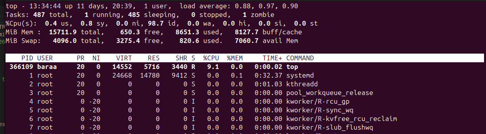

---
# =============================================================================
# MMU FCI Final Year Project Report — Quarto Configuration
# =============================================================================
# INSTRUCTIONS: Replace all placeholder values below with your actual details.
# This file is designed to work with fypStandard.cls
# =============================================================================

format:
  pdf:
    # -- Document class -------------------------------------------------------
    documentclass: fypStandard
    classoption: []

    # -- LaTeX engine (XeLaTeX for Arial font support via fontspec) -----------
    pdf-engine: xelatex

    # -- Disable Quarto's auto TOC/LOF/LOT so we place them manually ---------
    #    in the correct position within the preliminary pages (Roman numerals).
    toc: false
    lof: false
    lot: false

    # -- Section numbering & top-level-division = chapter ---------------------
    number-sections: true
    number-depth: 4
    top-level-division: chapter
    shift-heading-level-by: 0

    # -- Keep intermediate .tex for debugging ---------------------------------
    keep-tex: false

    # -- Custom variables passed to LaTeX via header --------------------------
    include-in-header:
      - text: |
          % ===================================================================
          % PROJECT METADATA — Edit these values for your project
          % ===================================================================
          \projectid{FYP01-IS-T2510-0001}
          \projecttitle{Your Approved Project Title Goes Here}
          \studentid{1234567890}
          \studentname{YOUR FULL NAME}
          \programme{BACHELOR OF INFORMATION TECHNOLOGY}
          \degreename{BACHELOR OF INFORMATION TECHNOLOGY}
          \submissionmonthyear{JUNE 2026}
          \submissionyear{2026}
          \reporttype{INTERIM}
          \supervisorname{Dr. Supervisor Name}
          \coursecode{CPT6314}
          \projectphase{Project I}
          \terminfo{2610 Term}

    include-before-body:
      - text: |
          % ===================================================================
          % PRELIMINARY PAGES (Cover, Title, Copyright, Declaration, etc.)
          % ===================================================================

          % -- Cover Page --
          \makecoverpage

          % -- Title Page --
          \maketitlepage

          % -- Switch to Roman numeral page numbering for preliminary pages --
          \frontmatteraliased

          % -- Copyright Page --
          \makecopyrightpage

          % -- Declaration Page --
          \makedeclarationpage

          % -- Acknowledgements --
          \begin{acknowledgements}
          I would like to express my sincere gratitude to my supervisor,
          for the continuous guidance and support throughout this project.

          I would also like to thank the Faculty of Computing and Informatics,
          Multimedia University, for providing the resources and environment
          necessary to complete this work.

          Finally, I am grateful to my family and friends for their
          encouragement and understanding.
          \end{acknowledgements}

          % -- Abstract --
          \begin{abstract}
          Write your abstract here. In one page, certainly not more than two,
          summarize the main features of your project; describe what problem
          you are solving and how you propose to solve it. This brief overview
          should give a snapshot of the overall structure of your final year
          project.
          \end{abstract}

          % -- Table of Contents (manually generated in prelim pages) --
          \renewcommand*\contentsname{TABLE OF CONTENTS}
          {
          \hypersetup{linkcolor=black}
          \setcounter{tocdepth}{3}
          \tableofcontents
          }

          % -- List of Tables --
          \listoftables

          % -- List of Figures --
          \listoffigures

          % -- List of Abbreviations (add your abbreviations below) --
          \begin{listofabbreviations}
          \begin{tabular}{@{}ll@{}}
          API   & Application Programming Interface \\
          FYP   & Final Year Project \\
          MMU   & Multimedia University \\
          FCI   & Faculty of Computing and Informatics \\
          UML   & Unified Modeling Language \\
          \end{tabular}
          \end{listofabbreviations}

          % -- List of Appendices --
          \begin{listofappendices}
          \begin{tabular}{@{}ll@{}}
          Appendix A & Gantt Chart \\
          Appendix B & FYP I Meeting Logs \\
          Appendix C & Turnitin Similarity Index Page \\
          \end{tabular}
          \end{listofappendices}

          % ===================================================================
          % SWITCH TO MAIN MATTER (Arabic page numbering starts at 1)
          % ===================================================================
          \mainmatteraliased

# -- Bibliography (APA style) -----------------------------------------------
bibliography: references.bib
csl: apa.csl
cite-method: citeproc
nocite: |
  @*
---

<!-- ========================================================================
     CHAPTER 1: INTRODUCTION
     ======================================================================== -->

# Introduction

## Overview

Provide an overview description of the project. How did the problem present itself to you in the first place? Describe the nature of the problem in detail.

## Problem Statement

Clearly define the problem that this project aims to address. Explain the context and significance of the problem.

## Project Objectives

The objectives of this project are as follows:

1. First objective.
2. Second objective.
3. Third objective.

## Project Scope

Define the boundaries of your project. What will be covered and what will not be covered.

## Project Limitations

Describe any known limitations or constraints of the project.

## Methodology

Briefly describe the methodology or approach that will be used in this project.

## Target Audience

Describe who will benefit from or use the outcome of this project.

## Summary

Summarize the key points covered in this chapter and provide a brief overview of the remaining chapters.

<!-- ========================================================================
     CHAPTER 2: LITERATURE REVIEW
     ======================================================================== -->

# Literature Review

## Overview

This chapter presents a comprehensive review of existing literature related to the project topic.

## Topic Title

### Sub-topic

Discuss relevant literature, prior work, and existing solutions related to your project.

| example | table |
| --- | --- |
| **Newest logs first** | `journalctl -r` |
| **Current boot only** | `journalctl -b` |
| **Follow live (real-time)** | `journalctl -f` |
| **Specific service** | `journalctl -u <Service Name>` |
| **Show last 50 lines** | `journalctl -n 50` |
: example table of commands

## Summary

Summarize the key findings from the literature review and identify the research gap.

<!-- ========================================================================
     CHAPTER 3: REQUIREMENTS ANALYSIS
     ======================================================================== -->

# Requirements Analysis

## Overview

This chapter describes the requirements gathering techniques and analysis of results.

## Fact-Finding Techniques

### Justification

Justify the choice of fact-finding techniques used.

### Questionnaire Design

#### Analysis on Results

Present and analyse the results of any questionnaires conducted.

### Observation

#### Analysis on Results

Present and analyse the results of any observations conducted.

## Requirements

### Functional Requirements

List and describe the functional requirements of the system.

### Non-functional Requirements

List and describe the non-functional requirements of the system.

### User Requirements

Describe the user requirements gathered from stakeholders.

<!-- ========================================================================
     CHAPTER 4: SYSTEM DESIGN
     ======================================================================== -->

# System Design

## Overview

This chapter presents the system design for the proposed solution.

## Rich Picture Diagram

Include and describe the rich picture diagram.

## Use Case Diagram

Include and describe the use case diagram.

## Activity Diagram

Include and describe the activity diagram.

## Class Diagram

Include and describe the class diagram.

## Sequence Diagram

Include and describe the sequence diagram.

## Interface Design

Present the interface designs and mockups.

## Summary

Summarize the system design decisions made.

<!-- ========================================================================
     CHAPTER 5: IMPLEMENTATION PLAN
     ======================================================================== -->

# Implementation Plan

## Development Phase

Describe the front-end and back-end coding plan.

## Testing Phase

Describe the testing strategy: unit testing, integration testing, system testing, and user acceptance testing (UAT).

## Deployment Phase

Describe the deployment plan, if applicable.

<!-- ========================================================================
     CHAPTER 6: CONCLUSION
     ======================================================================== -->

# Conclusion

Summarize what has been achieved related to the objectives, and what is to be achieved in the next phase of the project. Describe any issues experienced during the project such as problems encountered.

<!-- ========================================================================
     REFERENCES
     ======================================================================== -->

\newpage

# References {.unnumbered}

::: {#refs}
:::

<!-- ========================================================================
     APPENDICES
     ======================================================================== -->

\newpage
\appendix

# Gantt Chart {.unnumbered}

\addcontentsline{toc}{chapter}{Appendix A: Gantt Chart}

<!-- Option 1: Include a PDF file (recommended for PDFs) -->
<!-- Uncomment the line below and replace with your actual file path -->
<!-- \includepdf[pages=-]{gantt_chart.pdf} -->

<!-- Option 2: Include a PNG/JPG image -->
<!-- {width=100%} -->

Replace this text with your Gantt chart using one of the options above.

\newpage

# FYP I Meeting Logs {.unnumbered}

\addcontentsline{toc}{chapter}{Appendix B: FYP I Meeting Logs}

<!-- Include all 6+ meeting logs from a single PDF: -->
<!-- \includepdf[pages=-]{meeting_logs.pdf} -->

<!-- Or include them as separate PDFs: -->
<!-- \includepdf[pages=-]{meeting_log_1.pdf} -->
<!-- \includepdf[pages=-]{meeting_log_2.pdf} -->
<!-- \includepdf[pages=-]{meeting_log_3.pdf} -->
<!-- \includepdf[pages=-]{meeting_log_4.pdf} -->
<!-- \includepdf[pages=-]{meeting_log_5.pdf} -->
<!-- \includepdf[pages=-]{meeting_log_6.pdf} -->

<!-- Or include scanned images: -->
<!-- {width=100%} -->

Replace this text with your meeting logs using one of the options above.
A minimum of six (6) meeting logs are required.

\newpage

# Turnitin Similarity Index Page {.unnumbered}

\addcontentsline{toc}{chapter}{Appendix C: Turnitin Similarity Index Page}

<!-- Include the Turnitin report PDF (usually just 1 page): -->
<!-- \includepdf[pages=1]{turnitin_report.pdf} -->

<!-- Or if it's a screenshot/image: -->
<!-- {width=100%} -->

Replace this text with your Turnitin report using one of the options above.
Overall Similarity Index must be $\leq$ 20%.
